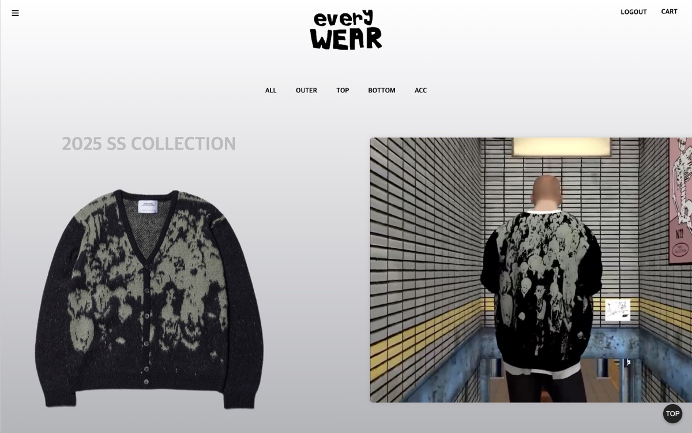
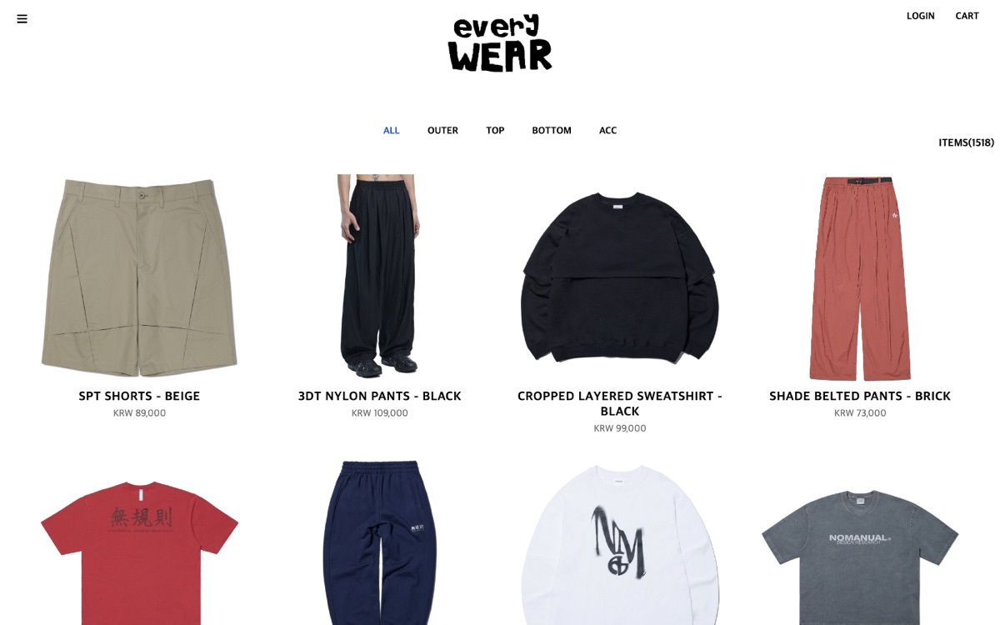
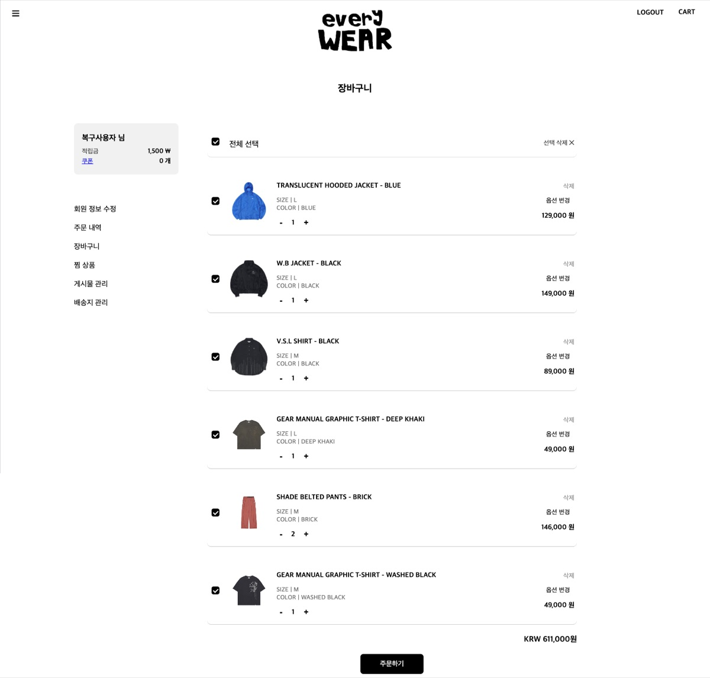
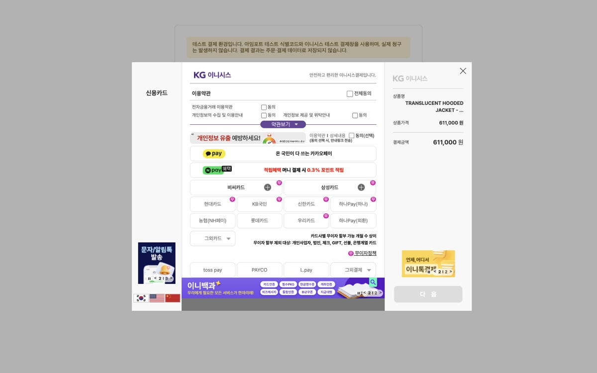
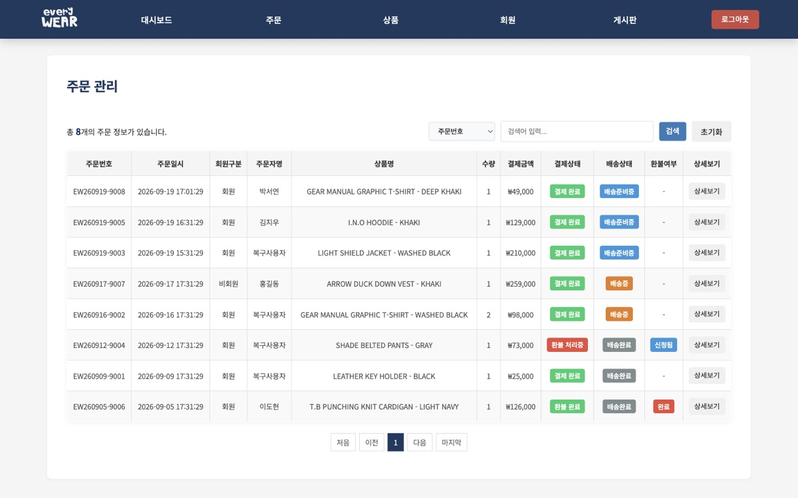

# everyWEAR - 의류 쇼핑몰 (Java JSP/Servlet, MySQL)

everyWEAR는 상품 탐색부터 장바구니·찜·주문까지 이어지는 사용자 쇼핑 기능과, 회원·상품·주문·배송·환불을 관리하는 관리자 기능을 갖춘 Java JSP/Servlet 기반 의류 쇼핑몰입니다.

실제 쇼핑몰에서 크롤링한 상품 1,518개를 카테고리·신상품·베스트로 둘러볼 수 있고, 사이즈를 골라 장바구니와 찜에 담은 뒤 주문서에서 쿠폰·적립금을 반영해 결제창까지 진행할 수 있습니다. 관리자는 이메일 인증번호로 로그인해 회원 등급·상태, 상품과 재고, 공지, 주문·배송·환불 상태를 관리합니다.

2025년 5인 팀 프로젝트로 개발했으며, 프로젝트 종료 후 서로 버전이 달라 실행되지 않던 작업본들을 분석해 실행 환경과 DB를 복구하고, 보안·결제·데이터 정합성 문제를 개인적으로 개선했습니다.

---

## 📌 프로젝트 개요

- **프로젝트명:** everyWEAR
- **개발 기간:** 2025.03.18 ~ 2025.04.17
- **프로젝트 형태:** 5인 팀 프로젝트 / 프로젝트 종료 후 개인 복구·개선
- **팀원:** 석인철, 이창건, 박민경, 정시영, 박규원
- **역할:** 팀장
- **규모:** Java 소스 75개, JSP 108개, 상품 1,518개 · 사이즈 4,112건 · 이미지 7,410건
- **GitHub:** 현재 저장소

---

## 🖼️ 화면

| 메인 | 상품 목록 |
|---|---|
|  |  |
| **장바구니** | **테스트 결제창** |
|  |  |



관리자 주문 관리 화면 (샘플 주문 데이터)

> 🎬 **전체 기능 시연:** 사용자·관리자 기능을 실제로 실행하며 촬영한 화면 79장을 [기능 시연 문서](docs/demo/README.md)([PDF](docs/demo/everyWEAR-demo.pdf))로 정리했습니다.

---

## 📱 주요 기능

### 🛍️ 상품

- 카테고리(OUTER·TOP·BOTTOM·ACC)와 하위 분류별 상품 목록
- 신상품(NEW)·베스트(BEST) 목록
- 상품 상세: 색상, 사이즈·재고 선택, 함께 구매 상품, 상품 문의

### 🛒 장바구니·찜·주문

- 장바구니 담기, 수량 변경, 선택 삭제
- 찜 추가·삭제와 찜 목록
- 주문서 작성: 주문자·배송지 입력, 쿠폰·적립금 반영
- 아임포트 테스트 결제창 연동
- 주문 내역 조회, 비회원 주문 조회

### 👤 회원

- 회원가입: 아이디 중복 확인, 휴대폰 본인확인, 주소, 신체 정보
- 일반 로그인, Google·Kakao 소셜 로그인
- 아이디 찾기, 비밀번호 재설정, 로그인 5회 실패 시 계정 잠금과 잠금 해제
- 회원정보 항목별 수정, 배송지 관리, 회원 탈퇴

### 💬 게시판

- 상품 문의·일반 문의 작성·수정·삭제, 비공개 문의, 이미지 첨부
- 리뷰 작성·수정·삭제(별점, 사진)
- 내가 쓴 리뷰·문의 모아 보기
- 공지사항, FAQ

### 🔧 관리자

- ID·비밀번호·등록 이메일 확인 후 메일 인증번호로 로그인
- 대시보드: 오늘 주문·신규 회원·탈퇴 회원 집계
- 회원 목록, 탈퇴 회원 사유별 조회, 회원별 CRM(등급·계정 상태·잠금 수정, 배송지, 게시글)
- 상품 등록·수정·삭제, 사이즈별 재고, 이미지 업로드, 3단계 카테고리·재고·할인 필터
- 공지 등록·수정·삭제, 중요 공지 표시
- 주문 검색·상세, 배송 상태 일괄 변경, 환불 요청 생성·상태 변경

---

## 🛠️ 사용 기술

### Server

- **Java 21** - 서버 기능 구현
- **JSP / Servlet 4.0** - 화면 출력과 요청 처리
- **Apache Tomcat 9** - 웹 애플리케이션 실행

### Database

- **MySQL 8** - 회원, 상품, 장바구니, 주문, 게시판 데이터 관리
- **JDBC / MySQL Connector/J** - Java와 MySQL 연동

### Frontend

- **HTML / CSS / JavaScript** - 쇼핑몰·관리자 화면 구성

### External Services

- **Google·Kakao OAuth** - 소셜 로그인
- **아임포트(이니시스 테스트)** - 결제창
- **Gmail SMTP / CoolSMS** - 인증번호 메일·문자 발송

### Data Collection

- **Python / Selenium / pandas** - 상품 데이터 크롤링과 SQL 변환 ([crawler/](crawler/))

### Structure & Security

- **DAO Pattern** - 요청 처리와 DB 접근 코드 분리
- **Servlet Filter** - 사용자·관리자 접근 제어
- **PBKDF2 / CSRF 토큰** - 비밀번호 해싱, 변경 요청 위조 방지

### Development Environment

- **Eclipse** (Dynamic Web Project)
- **JDK 21**
- **Git / GitHub**

---

## 🏆 내가 기여한 부분

### 1️⃣ 팀장 및 프로젝트 진행

- 5인 팀 프로젝트의 팀장 역할 수행
- 일정 관리와 기능별 역할 분담
- 팀원 코드 통합
- 프로젝트 최종 발표 담당

### 2️⃣ 관리자 기능 전체 개발

관리자 기능 전반을 담당했습니다.

- 이메일 인증번호 기반 관리자 로그인
- 대시보드 집계
- 회원 목록, 탈퇴 회원 관리, 회원별 CRM
- 상품 등록·수정·삭제, 이미지 업로드, 3단계 카테고리 필터
- 공지 관리
- 주문 조회, 배송 상태 변경, 환불 처리

### 3️⃣ 상품 데이터 수집 전담

- Selenium 크롤러로 22개 하위 카테고리의 상품 1,518개 수집
- 상품명·가격·설명·색상·이미지 추출, 설명에서 사이즈 정보 추출
- 사이즈가 빠진 상품을 따로 다시 크롤링해 보충
- 수집 결과를 FK 순서에 맞춘 INSERT SQL로 변환

### 4️⃣ 사용자 기능 공동 개발

- 로그인·회원가입
- 상품 목록
- 주문 내역·결제

### 5️⃣ 데이터베이스와 기획 공동 작업

- 팀원과 함께 DB 테이블과 관계 설계
- DB 연결 관리 코드 작성
- 전체 기획과 화면 설계 (세부 UI 구현은 팀원 담당)

---

## 🔧 프로젝트 종료 후 개인 복구·개선

팀 프로젝트 종료 후 남아 있던 작업본들은 서로 버전이 달라 어느 것도 그대로 실행되지 않았습니다. 가장 완성도가 높은 작업본을 기준으로 삼아 혼자 복구하고 개선했습니다.

### 1️⃣ 실행 환경과 DB 복구

- Java 21·Tomcat 9 기준으로 프로젝트 재구성
- DAO가 실제로 사용하는 테이블·컬럼을 기준으로 DB schema SQL 재작성
- DB 접속 정보와 외부 서비스 키를 환경변수로 분리

### 2️⃣ 비밀번호와 인증 보안

- 평문 비밀번호를 PBKDF2 해시로 전환, 기존 계정은 로그인 성공 시 자동 전환
- 로그인 성공 시 세션 ID 재발급, 로그인 후 이동 주소를 내부 경로로 제한
- 비밀번호 찾기·잠금 해제의 본인확인을 목적별로 분리하고 1회용 토큰으로 처리
- 로그아웃을 POST + CSRF 확인 방식으로 변경

### 3️⃣ 데이터 변경 요청 보호

- 사용자 변경 요청(장바구니·찜·배송지·회원정보·Q&A·리뷰)에 로그인·POST·CSRF·본인 소유 확인 추가
- 관리자 URL을 인증 필터로 보호, 관리자 변경 요청에 POST + CSRF 적용
- 업로드 파일의 형식·내용·크기 검사

### 4️⃣ 결제 금액 위조 차단

- 브라우저가 보낸 결제 금액을 검증 없이 저장하던 구조를 복원하지 않음
- 테스트 결제창까지만 되살리고 결과는 DB에 저장하지 않도록 처리
- 주문자 입력값 escape와 결제 금액 범위 검사

### 5️⃣ 데이터 정합성

- 회원가입, 관리자 상품·주문·배송·환불 변경에 transaction·rollback 적용
- 환불 상태가 허용된 순서로만 바뀌도록 수정
- 첨부파일 저장과 DB 저장이 어긋나지 않도록 실패 시 파일 정리

### 6️⃣ 기능 오류 수정

- Java 21에서 인증 메일이 발송되지 않던 문제 수정 (TLS 1.2 지정)
- 카카오가 개인 개발자 앱에 이메일을 주지 않아 회원번호 기반 식별로 변경
- 관리자 CRM 500 오류, 카테고리 목록 누락 수정
- 사이즈가 없던 상품 314개 중 304개를 보충 데이터로 복구

### 7️⃣ GitHub 공개 정리

- 테스트용 파일, 디버그용 서블릿, 개인 도메인·하드코딩된 주소 제거
- 설정값·개인정보가 남지 않았는지 확인 후 새 Git 기록으로 공개
- 원본 상품 데이터와 원본 화면 복원
- 사용자·관리자 기능을 실행하며 화면 79개로 검증

자세한 과정은 [복구 과정](docs/recovery-status.md)과 [주요 트러블슈팅](docs/troubleshooting.md)에 정리했습니다.

---

## 🚀 실행 환경 및 실행 방법

### 필요 환경

| 항목 | 기준 |
|---|---|
| JDK | JDK 21 |
| WAS | Apache Tomcat 9 |
| DB | MySQL 8 |
| JDBC Driver | MySQL Connector/J 8.0.32 |
| IDE | Eclipse IDE for Enterprise Java |
| 프로젝트 형식 | Eclipse Dynamic Web Project (context root: `JSPTP`) |

### 실행 순서

1. 저장소를 내려받습니다.
2. Eclipse에서 `Existing Projects into Workspace`로 프로젝트를 가져오고 JDK 21, Tomcat 9 runtime을 지정합니다.
3. [MySQL Connector/J 8.0.32](https://dev.mysql.com/downloads/connector/j/)를 내려받아 `src/main/webapp/WEB-INF/lib/`에 넣습니다.
4. 비어 있는 MySQL에 `utf8mb4`로 접속해 저장소 루트에서 아래 SQL을 순서대로 한 번 실행합니다. 첫 파일이 `everywear_recovery` DB를 만듭니다.

   ```sql
   SOURCE db/recovery_minimal.sql;
   SOURCE db/recovery_cart_schema.sql;
   SOURCE db/recovery_signup_schema.sql;
   SOURCE db/recovery_admin_auth_schema.sql;
   SOURCE db/recovery_order_schema.sql;
   SOURCE db/recovery_qna_review_schema.sql;
   SOURCE db/recovery_notice_schema.sql;
   SOURCE db/recovery_faq_schema.sql;
   SOURCE db/recovery_category_schema.sql;
   SOURCE db/original_product_catalog.sql;
   SOURCE db/original_product_image_url_fix.sql;
   SOURCE db/original_product_detail_supplement.sql;
   ```

5. 앱 전용 DB 계정을 만들어 `SELECT, INSERT, UPDATE, DELETE` 권한만 줍니다.
6. Tomcat 실행 환경(Eclipse 실행 구성의 Environment 또는 `setenv.sh`)에 `EVERYWEAR_DB_URL`, `EVERYWEAR_DB_USER`, `EVERYWEAR_DB_PASSWORD`를 설정합니다. 소셜 로그인·메일·문자 키는 선택 사항이며 변수 이름은 [config/recovery.env.example](config/recovery.env.example)에 있습니다.
7. Tomcat에 배포하고 `http://localhost:8080/JSPTP/main2.jsp`에 접속합니다.

| 테스트 계정 | 값 |
|---|---|
| ID | `recovery_user` |
| Password | `recovery_test_only` |

> 실제 DB 비밀번호와 외부 서비스 키는 저장소에 포함되지 않습니다. 관리자 계정도 공개 SQL에 넣지 않았습니다.

---

## 📚 관련 문서

- [기능 시연 (화면 79장)](docs/demo/README.md)
- [복구 과정](docs/recovery-status.md)
- [주요 트러블슈팅](docs/troubleshooting.md)
- [DB 복구와 데이터 구분](docs/db-recovery.md)
- [계정·인증 보안](docs/auth-security.md)
- [검증 가이드](docs/test-guide.md)
- [알려진 문제](docs/known-issues.md)
- [상품 데이터 크롤러](crawler/README.md)
- [Third-Party Notices](THIRD_PARTY_NOTICES.md)

---

## 📌 현재 범위

- 상품 데이터와 이미지가 실제 쇼핑몰(nomanual-shop.com)을 참고해 수집한 것이라, 공개 서비스로 배포하지 않고 로컬에서 실행하는 기준으로 복구했습니다.
- 결제는 테스트 결제창까지만 동작하며 주문·결제 내역은 저장하지 않습니다. 실제 PG 결제·환불은 구현하지 않았습니다.
- 문자 인증(CoolSMS)은 키를 설정하지 않아 휴대폰 인증이 필요한 회원가입·아이디 찾기를 끝까지 진행할 수 없습니다.
- Naver 로그인은 화면에서 제외했습니다(서버 코드는 남아 있음).
- 상품 이미지는 크롤링 당시의 외부 이미지 주소를 그대로 사용하므로 일부가 표시되지 않을 수 있습니다.
- 상품 10개는 사이즈 정보를 찾지 못해 장바구니에 담을 수 없고, 재고 수량은 당시 일괄 입력한 값(100)입니다.
- 이메일 변경 재인증, 관리자 OTP 재설계, JSP 전체 HTML escaping은 아직 하지 않았습니다.
- 이후 별도 프로젝트에서 Spring Boot로 다시 만들 계획입니다.

전체 목록은 [알려진 문제](docs/known-issues.md)에 있습니다.

---

## 📄 라이선스

원래 팀 프로젝트였던 코드이므로 별도의 오픈소스 라이선스를 부여하지 않습니다. 포함된 외부 라이브러리와 로그인 버튼 이미지는 각 원 라이선스와 브랜드 가이드라인을 따릅니다. 자세한 내용은 [THIRD_PARTY_NOTICES.md](THIRD_PARTY_NOTICES.md)를 참고하세요.
